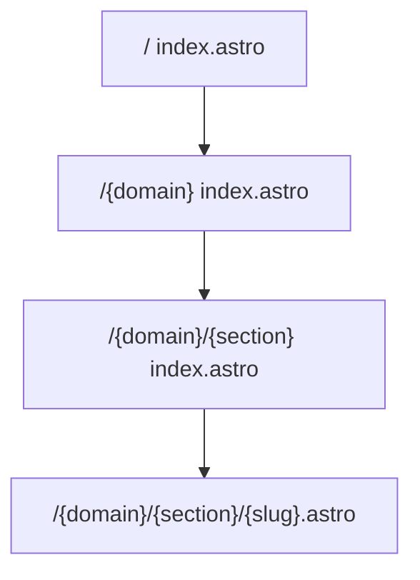
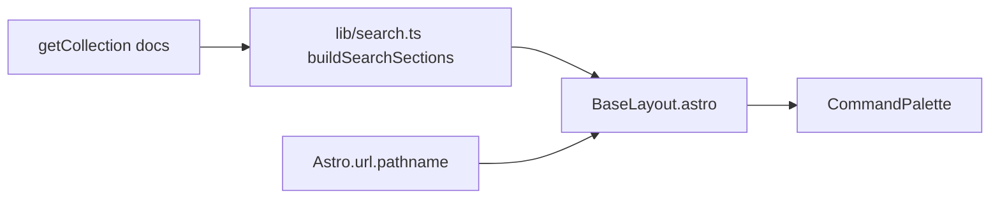

# code-design-guide — Astro wiki requirements

This document captures decisions from planning the migration of the static HTML prototypes to an Astro wiki. Implementation should happen on a dedicated branch (e.g. `astro-paper-design-spike`), not on the static prototype branch until explicitly merged.

## Project goal

Build an Astro site that replaces three root HTML prototypes, using existing design tokens and components as the visual foundation.

| Prototype | Paper artboard | Role |
|-----------|----------------|------|
| [`index.html`](index.html) | Prototype 1 — Variant 2 | Site homepage |
| [`landing-page.html`](landing-page.html) | Landing Page — Variant 2 | Section hub (e.g. React) |
| [`content-page.html`](content-page.html) | Content Page — Variant 1 | Article page (e.g. useRef) |

Styles live in [`css/`](css/) today; fonts in [`fonts/`](fonts/). Astro work should move these to `src/styles/` and `public/fonts/` per [CSS strategy](#css-and-fonts).

---

## Content hierarchy

The wiki is organized in four levels:

```text
Domain → Section → Chapter → Page
```

**Example tree (Code domain):**

```text
Code (domain)
├── React (section)
│   ├── Overview (chapter)
│   │   ├── useState (page)
│   │   ├── useRef (page)
│   │   └── useEffect (page)
│   ├── Concepts (chapter)
│   │   └── bi-directional data flow (page)
│   ├── Challenges (chapter)
│   └── React vs. Vanilla (chapter)
└── GSAP (section)
    ├── API (chapter)
    │   ├── tweens (page)
    │   ├── timelines (page)
    │   └── scrollTrigger (page)
    ├── Patterns (chapter)
    └── Animations (chapter)
        ├── Navigations (page)
        ├── Menus (page)
        ├── Text (page)
        └── Landing Pages (page)
```

**Other domains (structure TBD in content):**

- **Design** — Grids, Colors, Typography (each with overview pages, etc.)
- **AI** — Overview, Skills, Prompt Types
- **Tools** — TBD
- **References** — TBD (fifth top-level domain linked from homepage)

---

## Locked decisions

These were resolved in a structured planning session. Do not change without updating this file.

| Topic | Decision | Notes |
|-------|----------|-------|
| **URLs** | **B — flat under section** | `/code/react/use-ref`; `chapter` is metadata only, not in the path |
| **Content** | **A — one Markdown file per page** | Section and domain hubs are generated from the collection, not separate Markdown files |
| **Format** | **Markdown only** | No MDX; use GFM and inline HTML for tables, checklists, etc. |
| **Routes** | **A — explicit dynamic segments** | See [Route map](#route-map) |
| **Homepage** | Links to **domains** | `/code`, `/design`, `/ai`, `/tools`, `/references` |
| **Domain pages** | **A — auto section picker** | `/code` lists sections (React, GSAP, …) from the collection |
| **Article TOC** | **A — auto from headings** | `##` headings in Markdown; `rehype-slug` + build-time heading extraction |
| **Labels** | **B+** | From collection + title-cased slugs; optional `chapterLabel` in frontmatter |
| **Empty chapters** | **A — visible in nav** | Title-cased slug until pages exist; link to section hub anchor |
| **CSS** | **A — Astro best practice** | `src/styles/` + `public/fonts/`; global import in `BaseLayout.astro` |
| **Build order** | **A — vertical slice** | Article → section hub → domain hub → homepage |

---

## Route map



| URL | Template | HTML reference |
|-----|----------|----------------|
| `/` | Homepage | [`index.html`](index.html) |
| `/{domain}` | Domain hub (section list) | Generated |
| `/{domain}/{section}` | Section hub (chapters + pages) | [`landing-page.html`](landing-page.html) |
| `/{domain}/{section}/{slug}` | Article | [`content-page.html`](content-page.html) |

**Example URLs:**

- `/code` — domain hub
- `/code/react` — React section hub
- `/code/react/use-ref` — useRef article

### Astro route files

```text
src/pages/
  index.astro
  [domain]/
    index.astro
    [section]/
      index.astro
      [slug].astro
```

Each dynamic route uses `getStaticPaths()` driven by the `docs` content collection.

---

## Contextual sidebar

Sidebars change by page type. Reuse classes from [`css/components.css`](css/components.css) (`.sidebar`, `.sidebar__link`, etc.).

| Page type | URL example | Sidebar shows |
|-----------|-------------|----------------|
| **Domain** | `/code` | Sections in this domain only (React, GSAP, …) |
| **Section** | `/code/react` | **Sibling sections** in the same domain (e.g. GSAP only) — not chapter or page lists |
| **Article** | `/code/react/use-ref` | See below |

### Article sidebar (three blocks)

1. **On this page** — auto-generated from `h2`/`h3` headings in the current article (with slug anchors).
2. **Current chapter** — all pages in the same `chapter` as the current page (e.g. Overview: useState, useRef, useEffect).
3. **Other chapters** — remaining chapters in the section (Concepts, Challenges, React vs. Vanilla), including empty chapters (title-cased slug labels).

**Back link:** `← React` → `/{domain}/{section}` (e.g. `landing-page.html` pattern).

**Section hub main column** lists chapters and pages (like `landing-page.html` article groups), not in the sidebar.

---

## Content authoring

### File location

```text
src/content/{domain}/{section}/{slug}.md
```

The URL slug is the filename without `.md` (e.g. `use-ref.md` → `/code/react/use-ref`).

### Frontmatter schema

```yaml
---
domain: code          # required — code | design | ai | tools | references
section: react        # required — slug: react, gsap, grids, …
chapter: overview     # required — slug: overview, concepts, …
title: useRef           # required — display name for the page
order: 2                # required — sort order within chapter
description: optional   # lede / meta description for article header
chapterLabel: optional  # override title-cased chapter slug for labels
---
```

### Labels (B+)

| UI label | Source |
|----------|--------|
| Page name | `title` in frontmatter |
| Section name (hero) | Title-case `section` slug (`react` → React) |
| Chapter name | Unique `chapter` values from pages in section → title-case slug, unless `chapterLabel` is set |
| Domain name | Title-case `domain` slug |
| Empty chapter | Title-cased slug (e.g. `challenges` → Challenges); link to `/{domain}/{section}#{chapter}` on section hub |

No central `wiki.ts` label tree. Optional per-section `emptyChapters` config can be added later if slug-only labels are insufficient.

### Markdown conventions

- Use `##` for section headings (powers TOC and anchors).
- Fenced code blocks for examples.
- GFM tables for comparisons (e.g. useRef vs useState).
- Raw HTML allowed for checklists and complex blocks matching [`content-page.html`](content-page.html).

Existing Code chapter Markdown can be pasted into `src/content/code/` once the collection and article template exist.

---

## CSS and fonts

Follow Astro conventions:

```text
src/styles/
  tokens.css
  fonts.css      # @font-face paths → /fonts/...
  reset.css
  layout.css
  components.css
  global.css     # optional single import entry

public/fonts/    # copy or symlink from /fonts
```

Import global styles once in `BaseLayout.astro`. Update `@font-face` URLs to `/fonts/...` if paths change.

Keep prototype HTML at repo root until Astro pages match; then archive or remove `index.html`, `landing-page.html`, `content-page.html`.

---

## Implementation order (vertical slice)

1. Create Astro 5 project on a **new branch** (`npm create astro@latest`, minimal template, content collections).
2. Move CSS and fonts into `src/styles/` and `public/fonts/`.
3. Define `docs` content collection with Zod schema (frontmatter above).
4. **Slice:** port [`content-page.html`](content-page.html) → `use-ref.md` + `[slug].astro` + article sidebar/TOC utilities.
5. Port [`landing-page.html`](landing-page.html) → `[section]/index.astro`.
6. Add `[domain]/index.astro` (section picker).
7. Port [`index.html`](index.html) → `index.astro` (links to five domains).
8. Paste remaining Code chapter Markdown from author.
9. Add `@cmd-kit/astro` (see below).
10. Visual QA at 1440px against Paper; archive static HTML when acceptable.

---

## Global search (Cmd+K)

### Requirement

Implement **Cmd+K** (default `mod+k`) command palette for navigation across:

- Domains
- Sections
- Chapters
- Pages

With **scope awareness** on the current page (prioritize items relevant to the current domain/section).

### Package: `@cmd-kit/astro`

- **npm:** https://www.npmjs.com/package/@cmd-kit/astro
- **Docs:** https://cmd-kit.vercel.app/docs/astro
- **Peer dependency:** `astro ^5.5.2`
- **Install:** `npm install @cmd-kit/astro`

### Assessment: viable with constraints

| Criterion | Verdict |
|-----------|---------|
| Astro 5 | Supported via peer dependency |
| Keyboard shortcut | `mod+k` built in (configurable via `shortcut` prop) |
| Integration | `<CommandPalette />` from `@cmd-kit/astro/component` in `BaseLayout.astro` |
| Nested navigation | `sections` / `items` with `children` maps to domain → section → chapter → page |
| Static site | Items built at compile time from `getCollection('docs')` |
| Config shape | `source` is a serializable `CommandSourcePayload` — compose in Astro, not a runtime JS function |

**Will not provide:** full-text search inside article body. cmd-kit is a command palette (jump-to navigation), not Pagefind/Algolia. Body search is out of scope unless added later.

### Implementation approach



1. **`src/lib/search.ts`** — Build nested `sections` from all docs entries: group by domain → section → chapter → page; each item has `id`, `title`, `subtitle`, `href`.
2. **`BaseLayout.astro`** — Read `Astro.url.pathname` and order/filter groups:
   - On an article: top group **“This section”** (pages in current section), then **“This domain”**, then **“All”**.
   - On a section hub: prioritize sibling sections and pages in that section.
   - On a domain hub: prioritize sections in that domain.
3. **Empty chapters** — Include as items linking to `/{domain}/{section}#{chapter}` on the section hub.
4. **Theme** — Pass `theme.light` / `theme.dark` aligned with [`css/tokens.css`](css/tokens.css) (background, accent, text).
5. **Pin version** — Package is young (v0.1.x); pin exact version in `package.json`.

Use the cmd-kit playground export target **Astro** to generate initial `sections` JSON, then refactor into `buildSearchSections()`.

---

## Out of scope (initial release)

- MDX and Astro content components for prose
- Full-text / fuzzy search across article bodies
- Central `wiki.ts` navigation tree (B+ replaces)
- Auto-generated homepage topic lists from collection (homepage is hand-curated links to five domains)
- Implementing Astro on `main` before the dedicated branch is ready

---

## Open items (resolve on implementation branch)

1. **References domain** — Define sections, chapters, and pages.
2. **Section hub chapters** — Merge chapter list from pages in section plus any empty-chapter slugs (recommend union of all `chapter` values in section + optional `emptyChapters` array in `src/config/sections.ts` if needed).
3. **Homepage content** — Static configuration in `index.astro` for editorial copy and domain links (not driven by collection).
4. **cmd-kit API details** — Confirm `sections` vs `source` props against latest docs when integrating.

---

## Related files

| File | Purpose |
|------|---------|
| [`index.html`](index.html) | Homepage prototype |
| [`landing-page.html`](landing-page.html) | Section hub prototype |
| [`content-page.html`](content-page.html) | Article prototype |
| [`css/tokens.css`](css/tokens.css) | Design tokens |
| [`css/components.css`](css/components.css) | Components including landing/article patterns |
| [`README.md`](README.md) | Static prototype preview instructions |
