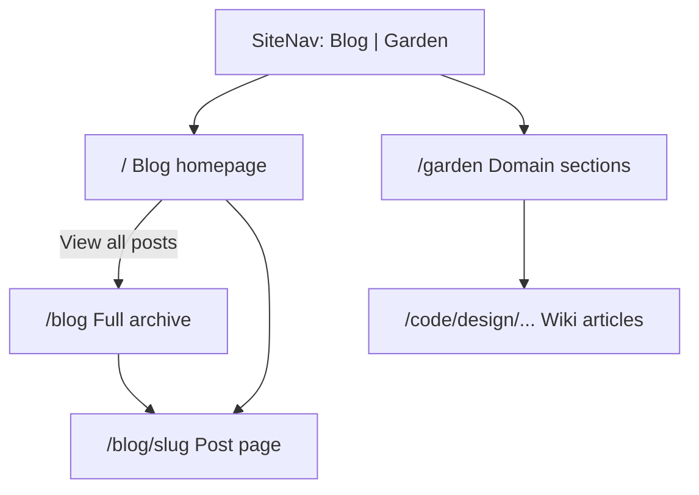

# Blog + Garden Plan

Split the site into **Blog** (primary, `/`) and **Garden** (reference wiki, `/garden`). Add a `blog` content collection, new blog homepage design, Cmd+K integration, and post pages that reuse the existing article shell.

## Locked decisions (grilling session)

| Decision | Choice |
|----------|--------|
| Homepage post display | Cap at 5 recent on `/`; "View all posts →" links to `/blog` archive |
| `pubDate` visibility | Everywhere — `/`, `/blog`, and post pages (below title/lede) |
| Cmd+K search | Dedicated "Blog" section for live posts |
| Empty blog on `/` | Intro block + muted "No posts yet." when no live posts |
| Future-dated posts | Hidden until `pubDate <= today` (even if `published: true`) |
| Slug | Derived from filename stem — no `slug` in frontmatter |
| Sidebar "More posts" | Cap at 5–8 most recent (exclude current) |
| Site structure | **Blog = primary** (`/`), **Garden = reference wiki** (`/garden`) |
| Routing | **`/`** = blog homepage · **`/blog`** = full archive · **`/blog/[slug]`** = posts · **`/garden`** = current domain-section homepage |
| Blog homepage layout | **C enhanced** — short intro block + `topic-list` cards with date, title, description |
| Site nav branding | Logo text **"My Website For This"** in `--font-serif`; left edge aligned with `.topic-section__main` content column |

## Architecture



**Mental model:** Visitors land on Blog (`/`). Garden (`/garden`) is the personal reference wiki (Code, Design, AI, Tools, References). Wiki routes under `/{domain}/...` are unchanged.

## Implementation checklist

- [ ] Add `blog` collection to `src/content.config.ts`
- [ ] Create `src/lib/blog.ts`
- [ ] Create `src/lib/nav.ts`
- [ ] Update `SiteNav.astro` + nav CSS
- [ ] Move current homepage to `src/pages/garden/index.astro`
- [ ] New blog homepage at `src/pages/index.astro`
- [ ] Create `src/pages/blog/index.astro` and `[slug].astro`
- [ ] Create `BlogSidebar.astro`
- [ ] Update Cmd+K search
- [ ] Update Barba namespaces
- [ ] Add sample blog content

## Site navigation

- Logo: **"My Website For This"** — serif, aligned with `.topic-section__main` (`padding-inline: var(--space-20)`, `width: var(--layout-main)`)
- Nav links: **Blog** (`/`) · **Garden** (`/garden`)
- Blog active on `/` and `/blog/*`; Garden active on `/garden` and `/{domain}/*`

## Blog homepage (`/`)

```
[intro block — site name + lede]
[section label — "Writing"]
[topic-list cards × 5 — date, title, description]
[View all posts → /blog]
```

## Content schema

```yaml
---
title: "Hello World"
description: "First blog post."
pubDate: 2026-06-24
published: true
---
```

Slug derived from filename (`hello-world.md` → `/blog/hello-world`).
