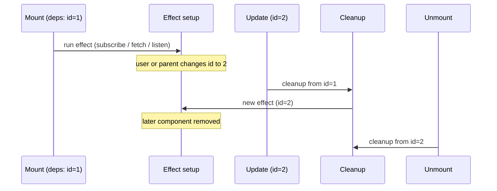

# useEffect

**`useEffect`** lets a component **run side effects after render** — work that reaches **outside** React’s render output: the network, timers, the DOM, subscriptions, and other browser APIs. It is **not** for computing what JSX should be; that stays in the component body or derived values.

For how effects sit **after paint** in the browser pipeline, see [React rendering flow](/course-notes/react-rendering-flow).


> **Rule #0**
> When a component renders, it should do so
> without running into any side effects

> **Rule #1**
> If a side effect is triggered by an event, put
> that side effect in an event handler

> **Rule #2**
> If a side effect is synchronizing your component with some
> external system, put that side effect in useEffect

> **Rule #4**
> If a side effect is subscribing to an external store, use the useSyncExternalStore hook


Adjusted for React, a component has a side effect any time it does anything other than take some input, props and state, and calculate some output, a View.

API calls, manual DOM manipulation, using browser APIs like localStorage or setTimeout, or anything else that falls outside of simply calculating a View based on props and state is a side effect.


---

## What `useEffect` is

| Idea | Detail |
|------|--------|
| **When it runs** | After React has **committed** DOM updates for that render, and — for the **default** (“passive”) effect — **after the browser has painted** the result. So it does not block the user from seeing pixels first. |
| **What you put in it** | **Side effects**: `fetch`, `addEventListener`, `setInterval`, opening a WebSocket, subscribing to a store, mutating non-React state, etc. |
| **What you avoid** | **Deriving UI from props/state** (do that during render). **Synchronous layout** that must run before paint (reach for `useLayoutEffect` when you truly need it). |

```jsx
import { useEffect, useState } from 'react';

function Example() {
  const [n, setN] = useState(0);

  useEffect(() => {
    document.title = `Count is ${n}`;
  }, [n]);

  return <button onClick={() => setN((x) => x + 1)}>{n}</button>;
}
```

The **second argument** is the **dependency array**:

- **`[n]`** — run the effect **after** render when `n` changed (and once on mount).
- **`[]`** — run **once** after mount (and cleanup on unmount).
- **Omitted** (`useEffect(() => { … })`) — run **after every** render. Easy to misuse; prefer an explicit dependency list whenever you know what should trigger the effect.

---


## Event handlers


Put the `localStorage` operation in the event handler.

```jsx
import * as React from "react"

function Greeting ({ name }) {
  const [index, setIndex] = React.useState(0)

  const greetings = ['Hello', "Hola", "Bonjour"]

  const handleClick = () => {
    const nextIndex = index === greetings.length - 1
      ? 0
      : index + 1
    setIndex(nextIndex)

    localStorage.setItem("index", nextIndex)
  }

  return (
    <main>
      <h1>{greetings[index]}, {name}</h1>
      <button onClick={handleClick}>Next Greeting</button>
    </main>
  )
}

export default function App () {
  return <Greeting name="Tyler" />
}

```


## Handling external sources

For **Rule 2**, we can use the hook `useEffect`.

```jsx
import * as React from "react"

export default function BatteryLevel() {
  const [level, setLevel] = React.useState(0)

  React.useEffect(() => {
    console.log("Getting battery level...")
    navigator.getBattery().then(battery => {
      const newLevel = Math.round(battery.level * 100)

      if (newLevel !== level) {
        setLevel(newLevel)
      }
    })
  })

  console.log("Rendering")
  return (
    <p>{level}%</p>
  )
}
```


1. Initial render sets state to 0 and we log "Rendering"
2. After the initial render, useEffect is called which logs "Getting battery level..." before the async call
3. The promise is fullfilled, and if the `newLevel` is different, we update `setLevel` to re-render
4. The re-render logs "Rendering" again, rendering completes and our effect is called again logging "Getting battery level..." but the `newLevel` has not changed, so our effect is done


## What about just calling it once?

Instead, really all we want to do is run some side effect on the initial render, set that value to state, and then be done with it. Continuing to call the side effect on every render is a waste. Thankfully, useEffect accepts a second argument that gives us a little bit more control over when our effect is called.

```jsx
React.useEffect(() => {
  document.title = `Welcome, ${name}`
}, [name])
```


Now, the effect will run once instead of every re-render
```jsx
import * as React from "react"

export default function BatteryLevel() {
  const [level, setLevel] = React.useState(0)

  React.useEffect(() => {
    console.log("Getting battery level...")
    navigator.getBattery().then(battery => {
      const newLevel = Math.round(battery.level * 100)

      if (newLevel !== level) {
        setLevel(newLevel)
      }
    })
  }, [])

  console.log("Rendering")
  return (
    <p>{level}%</p>
  )
}

// Rendering
// Getting battery level...
// Rendering

```

Now, let's `getItem` with `localStorage` once:


```jsx
import * as React from "react"

function Greeting ({ name }) {
  const [index, setIndex] = React.useState(0)

  const greetings = ['Hello', "Hola", "Bonjour"]

  const handleClick = () => {
    const nextIndex = index === greetings.length - 1
      ? 0
      : index + 1
    setIndex(nextIndex)

    localStorage.setItem("index", nextIndex)
  }

  React.useEffect(() => {
    const item = localStorage.getItem("index")

    if (item) {
      setIndex(Number(item))
    }
  }, [])

  return (
    <main>
      <h1>{greetings[index]}, {name}</h1>
      <button onClick={handleClick}>Next Greeting</button>
    </main>
  )
}

export default function App () {
  return <Greeting name="Tyler" />
}
```


## Async network request and useEffect

When the id changes from a click, keyboard event or update from another function, we can "listen" for the `id` change and call our `useEffect` when it changes.

```jsx
import * as React from "react"
import { fetchPokemon } from "./api"

export default function App () {
  const [id, setId] = React.useState(1)
  const [pokemon, setPokemon] = React.useState(null)
  const [loading, setLoading] = React.useState(true)
  const [error, setError] = React.useState(null)

  React.useEffect(() => {
    const handleFetchPokemon = async () => {
      setLoading(true)
      setError(null)

      const { error, response } = await fetchPokemon(id)

      if (error) {
        setError(error.message)
      } else {
        setPokemon(response)
      }

      setLoading(false)
    }

    handleFetchPokemon()
  }, [id])

  return (
    <main>
      {JSON.stringify({ id, loading, error, pokemon }, null, 2)}
    </main>
  )
}
```


Implementing it with a pokemon component:
```jsx
import * as React from "react"
import { fetchPokemon } from "./api"
import Carousel from "./Carousel"
import PokemonCard from "./PokemonCard"

export default function App () {
  const [id, setId] = React.useState(1)
  const [pokemon, setPokemon] = React.useState(null)
  const [loading, setLoading] = React.useState(true)
  const [error, setError] = React.useState(null)

  const handlePrevious = () => {
    if (id > 1) {
      setId(id - 1) 
    }
  }

  const handleNext = () => setId(id + 1)

  React.useEffect(() => {
    const handleFetchPokemon = async () => {
      setLoading(true)
      setError(null)

      const { error, response } = await fetchPokemon(id)

      if (error) {
        setError(error.message)
      } else {
        setPokemon(response)
      }

      setLoading(false)
    }

    handleFetchPokemon()
  }, [id])

  return (
    <Carousel onPrevious={handlePrevious} onNext={handleNext}>
      <PokemonCard 
        loading={loading} 
        error={error} 
        data={pokemon} 
      />
    </Carousel>
  )
}
```


But, how to handle re-renders while an async task is pending?
We have to track these requests via ??? and cancel the previous request before re-running the effect.


> If you return a function from your effect, React will call that function each time before it ever calls your effect again, and then one final time when the component is removed from the DOM.


```jsx
import * as React from "react"

export default function App () {
  const [count, setCount] = React.useState(0)

  React.useEffect(() => {
    console.log(`In effect: ${count}`)
    return () => {
      console.log(`In cleanup: ${count}`)
    }
  }, [count])

  const handleClick = () => setCount(count + 1)

  if (count > 3) {
    return null
  }

  return (
    <button onClick={handleClick}>
      {count}
    </button>
  )
}
```


Now we can ignore the last effect while in Pending status to ensure our new request is dsplayed:


> **Remember** `ignore` is scoped to `useEffect` and will be reset

```jsx
import * as React from "react"
import { fetchPokemon } from "./api"
import Carousel from "./Carousel"
import PokemonCard from "./PokemonCard"

export default function App () {
  const [id, setId] = React.useState(1)
  const [pokemon, setPokemon] = React.useState(null)
  const [loading, setLoading] = React.useState(true)
  const [error, setError] = React.useState(null)

  const handlePrevious = () => {
    if (id > 1) {
      setId(id - 1) 
    }
  }

  const handleNext = () => setId(id + 1)

  React.useEffect(() => {
    let ignore = false

    const handleFetchPokemon = async () => {
      setLoading(true)
      setError(null)

      const { error, response } = await fetchPokemon(id)

      if (ignore) {
        return
      } else if (error) {
        setError(error.message)
      } else {
        setPokemon(response)
      }

      setLoading(false)
    }

    handleFetchPokemon()

    return () => {
      ignore = true
    }
  }, [id])

  return (
    <Carousel onPrevious={handlePrevious} onNext={handleNext}>
      <PokemonCard 
        loading={loading} 
        error={error} 
        data={pokemon} 
      />
    </Carousel>
  )
}
```

## Sidenote: Closures and useEffect

```jsx
useEffect(() => {
  let cancelled = false;
  fetch(`/api/users/${userId}`)
    .then((r) => r.json())
    .then((user) => {
      if (!cancelled) setUser(user);
    });
  return () => {
    cancelled = true;
  };
}, [userId]);
```


React runs your effect after paint and stores whatever function you **return** as that effect’s **cleanup** for that hook slot. That cleanup is a normal JS function, so it closes over the **`cancelled` binding created in that same effect run**. When `userId` changes or the component unmounts, React runs **that stored cleanup** before running the next effect (or finishing unmount). That flips **`cancelled` only for the old run**, so an old in-flight `.then` sees `true` and skips `setUser`. A new effect run is a **new** function call, so it gets a **new** `let cancelled = false` and a **new** cleanup. React does **not** put `cancelled` in component state; it only remembers hook data (including the last cleanup reference and the last deps array) on the fiber.


### Sequencing, Bookkeeping, Closures

Assume `userId` goes `1 → 2`, and request “1” finishes after “2” is already in flight.

| Step | Trigger | React (fiber / hook bookkeeping) | Your code / JS | `cancelled` (by closure) |
|------|---------|-----------------------------------|----------------|----------------------------|
| 1 | First mount | Allocates hook slot #N; no prior cleanup | Render runs; effect **not** run during render | — |
| 2 | After commit | Schedules passive effects | — | — |
| 3 | Effect phase | Runs effect for slot #N; saves returned cleanup as **destroy for run A** | **Closure A**: `let cancelled = false` (binding A); starts `fetch`; returns `() => { cancelled = true }` (closes over **A**) | A = `false` |
| 4 | (async) | — | Response for user 1 still pending | A still `false` |
| 5 | `userId` becomes `2` | Re-render | Component body runs with new `userId` | — |
| 6 | Render end | Compares **new** `[2]` to **stored** `[1]` → deps changed | — | — |
| 7 | Commit + effect flush | For slot #N: calls **stored destroy (run A’s cleanup)** | Cleanup runs: sets **binding A** to `true` | A = **`true`** |
| 8 | Same flush | Runs **new** effect for slot #N; saves new cleanup as **destroy for run B** | **Closure B**: `let cancelled = false` (binding B); starts second `fetch`; new cleanup closes over **B** | B = `false` (A unchanged, still `true`) |
| 9 | Request 1 completes | — | Old `.then` runs in **closure A**, reads A → `if (!cancelled)` fails | A = `true` → **no `setUser`** |
|10 | Request 2 completes | — | New `.then` runs in **closure B**, reads B | B = `false` → **`setUser`** runs |

**How to read the table:** “React bookkeeping” is *per hook slot* (fixed order in the component). “Closure A / B” is *per effect invocation*. Cleanup always targets the **binding from the run that returned it**.

**Unmount:** same as a dep change for teardown: React calls the latest stored cleanup (e.g. closure B’s), sets B’s `cancelled` to `true`, and does not run a new effect.

---

## Dependency array and `Object.is` — what that means

**Dependency array:** the optional second argument to `useEffect(fn, deps)`. React treats `deps` as a list of values that should represent “everything from the render that this effect reads.” When any entry is considered “changed” since last time, React treats the effect as stale: run previous cleanup, run the effect again.

**`Object.is`:** React compares the **previous** `deps[i]` and **current** `deps[i]` with `Object.is` for each index (and length). For numbers/strings/booleans it behaves like `===`. The notable differences vs `===` are that `Object.is(NaN, NaN)` is true and `Object.is(+0, -0)` is false.

**How React “knows”:** On each render, hooks run in a **fixed order**. Internally, the fiber keeps a linked list of hook cells (often under names like `memoizedState` / `updateQueue` depending on hook type). For `useEffect`, each cell remembers things like: last dependency array, the passive effect flags, and the **destroy** function from the last successful run. On the next render, React walks the same hook order, pulls the **stored** deps for that cell, compares to the **new** deps with `Object.is`, and decides whether to schedule “cleanup old + run new.” No deep diff of objects: if you pass an object you created in the render, `Object.is(prev, next)` is false every time unless you stabilized the reference (e.g. `useMemo`).

That is the whole bridge between “plain JS closures” and “React knows what to run”: **stable hook order + stored deps + stored cleanup reference**, not React reading your `cancelled` variable directly.


## Cleanup function gotcha for event handlers


Another gotcha is that don't want to add/remove handlers for every change on our dependencies in the `useEffect` hook.

With the commented out code, our effect will add/remove the same event listener.

By passing `setCount` a function, we pass the `count` state to it! A cool react feature.
Thus, we can skip running `useEffect` everytime `count` changes, which is more performant.

We will execute `handleChange` with the once attached listeners, instead of re-registers it over and via `useEffect`.[count].


```jsx
import * as React from "react"

export default function TabAways () {
  const [count, setCount] = React.useState(0)
  
  React.useEffect(() => {
    const handleChange = () => {
      if (document.visibilityState !== "visible") {
        // setCount(count + 1) uses the closure to update state and thus we have to pass in the count in the dependency array
        setCount((c) => c + 1)
      }
    }

    console.log("addEventListener")
    document.addEventListener("visibilitychange", handleChange)

    return () => {
      console.log("removeEventListener")
      document.removeEventListener("visibilitychange", handleChange)
    }
  }, []) // was [count]

  return (
    <p>
      You've tabbed away <strong>{count}</strong> time{count !== 1 && "s"}.
    </p>
  )
}

```


## When does the cleanup function run?

If your effect callback **returns a function**, React treats it as a **cleanup** function.

Cleanup runs in exactly two situations:

| Situation | What happens |
|-----------|----------------|
| **A. The effect is about to run again** | Dependencies **changed** (or you used a missing dependency list and every render re-schedules the effect). React **first** runs the **previous** cleanup, **then** runs the new effect body. |
| **B. The component unmounts** | React runs cleanup for the **last** committed version of the effect so you can release resources. |

So: **cleanup = “tear down what the last run of this effect set up,”** either because inputs changed or because the component is leaving the tree.



**Order on reordering:** When dependency changes: **cleanup → new effect**. On unmount: **cleanup only**.

**Strict Mode (development):** React may **mount → unmount → remount** once to help you find missing cleanups. If cleanup is correct, the effect still works; if not, you’ll see duplicated listeners or requests until you fix it.


| Question | Answer |
|----------|--------|
| Does cleanup run on **every** render? | **No.** It runs **before** the next effect run (if deps changed) and on **unmount**. |
| If deps are `[]`, when does cleanup run? | **Only on unmount** (and in Strict Mode’s dev remount cycle). |
| Why abort `fetch` in cleanup? | So a **late response** does not update state after unmount or with an **outdated** `userId`. |
| Is empty deps `[]` “run once”? | **Runs once per mount** in production; dev Strict Mode may run effects **twice** to surface bugs — design cleanup so that is safe. |


---

# Examples

## `fetch` and `AbortController` (cleanup cancels the request)

If the user navigates away or a dependency (e.g. `userId`) changes **before** `fetch` finishes, you should **abort** the request so an old response cannot call `setState` on an unmounted component or with stale data.

```jsx
import { useEffect, useState } from 'react';

function UserProfile({ userId }) {
  const [data, setData] = useState(null);
  const [error, setError] = useState(null);

  useEffect(() => {
    setData(null);
    setError(null);

    const controller = new AbortController();

    fetch(`https://jsonplaceholder.typicode.com/users/${userId}`, {
      signal: controller.signal,
    })
      .then((res) => {
        if (!res.ok) throw new Error(res.statusText);
        return res.json();
      })
      .then(setData)
      .catch((err) => {
        if (err.name === 'AbortError') return;
        setError(err);
      });

    return () => controller.abort();
  }, [userId]);

  if (error) return <p role="alert">{String(error)}</p>;
  if (!data) return <p>Loading…</p>;

  return <p>{data.name}</p>;
}
```

**What cleanup does here:** When `userId` changes or the component unmounts, `abort()` runs. The in-flight `fetch` rejects with `AbortError`; you ignore that in `catch` so it does not look like a real failure.

---

## `window` event listener

Listeners must be **removed** when the effect is torn down; otherwise you leak listeners (and stale closures) across hot paths.

```jsx
import { useEffect, useState } from 'react';

function WindowWidth() {
  const [w, setW] = useState(() => window.innerWidth);

  useEffect(() => {
    const handler = () => setW(window.innerWidth);
    window.addEventListener('resize', handler);
    return () => window.removeEventListener('resize', handler);
  }, []);

  return <span>{w}px</span>;
}
```

**Why store `handler` in a variable:** `removeEventListener` must receive the **same function reference** you passed to `addEventListener`.

---

## DOM / custom element listener

Same pattern with a ref if you attach to a specific node:

```jsx
import { useEffect, useRef } from 'react';

function ClickOutside({ children, onOutside }) {
  const ref = useRef(null);

  useEffect(() => {
    const el = ref.current;
    if (!el) return;

    function handlePointerDown(event) {
      if (!el.contains(event.target)) onOutside();
    }

    document.addEventListener('pointerdown', handlePointerDown);
    return () => document.removeEventListener('pointerdown', handlePointerDown);
  }, [onOutside]);

  return <div ref={ref}>{children}</div>;
}
```

If `onOutside` is recreated every render, this effect re-runs often; parents often wrap that callback in **`useCallback`** so the dependency stays stable when appropriate.

---

## `setInterval` / `setTimeout`

Timers must be **cleared** on cleanup so they do not fire after unmount or after logic should stop.

```jsx
import { useEffect, useState } from 'react';

function Clock() {
  const [now, setNow] = useState(() => new Date());

  useEffect(() => {
    const id = window.setInterval(() => setNow(new Date()), 1000);
    return () => window.clearInterval(id);
  }, []);

  return <time>{now.toLocaleTimeString()}</time>;
}
```

---

## Other cleanup patterns (same rule)

| Pattern | Setup | Cleanup |
|---------|--------|---------|
| **Third-party subscription** | `const sub = client.subscribe(fn)` | `sub.unsubscribe()` |
| **WebSocket** | `new WebSocket(url)` | `socket.close()` |
| **`matchMedia`** | `mql.addEventListener('change', fn)` | `mql.removeEventListener('change', fn)` |
| **BroadcastChannel / channel port** | `new BroadcastChannel('x')` | `channel.close()` |

The **rule** is always: **whatever you start in the effect, stop or undo it in cleanup** when the effect’s “session” for those dependencies ends.


That sentence is from your `useState` lesson. It contrasts **how you update UI in React** with **how you might do it in plain JavaScript**.

---

## Two different “homes” for the value

Every time React renders your component, it **calls your function again**. That creates a **new set of local variables** for that run:

```jsx
function VibeCheck() {
  const [status, setStatus] = React.useState("clean")  // `status` for THIS render only
  // ...
}
```

Render 1: `status` is the local name for `"clean"`.  
Render 2 (after click): `status` is a **new** local name for `"dirty"`.

Those are not the same variable in memory. They are two **snapshots**. The old `status` from render 1 still exists only inside the old `handleClick` closure until garbage collection — you do not “go back and edit” it.

**“Previous render’s variables”** = `status`, `count`, `handleClick`, etc. from the last time the function ran.

---

## What “you do not mutate … yourself” means

**Mutate** = change something in place, expecting everyone to see the new value immediately.

In vanilla JS you might do:

```js
let count = 0

button.onclick = () => {
  count++                    // you own the variable; you changed it
  label.textContent = count  // you drive the UI yourself
}
```

In React, this is the wrong mental model:

```js
// Wrong — does not schedule a re-render, React does not know
status = "dirty"

// Wrong for objects/arrays — same reference, React may skip update
todos.push(newTodo)
```

You do **not** treat `status` or `count` as the source of truth you edit by assignment. You call the setter:

```js
setStatus("dirty")   // “React, next render should use this value”
```

The `status` in the **current** render’s scope does not flip to `"dirty"` inside that same run (hence `alert(status)` still showing `"clean"`). You are not supposed to “fix” that by mutating `status`; you either accept the snapshot model or pass the new value explicitly (`alert("dirty")`).

So: **you don’t update the old render’s locals; you request a new render with new state.**

---

## What “React keeps the canonical value” means

**Canonical** = the one official copy React trusts, stored **outside** your function, tied to **this component instance** and **this hook slot** (first `useState`, second `useState`, etc.).

Rough picture:

```text
YOUR COMPONENT FUNCTION          REACT (per instance)
───────────────────────          ───────────────────
Render 1 runs                    Hook memory slot 0: "clean"
  const status = "clean"  ◄──── reads from slot
  setStatus("dirty")      ────► writes "dirty" to slot, schedules render

Render 2 runs                    Hook memory slot 0: "dirty"  ← canonical
  const status = "dirty"  ◄──── reads from slot
```

Your local `status` each render is a **copy for this snapshot**. The **canonical** value lives in React’s hook list and survives between renders. `setStatus` updates **that**, not “the `status` variable from last time.”

---

## What “drives the UI from it” means

After the canonical value changes, React:

1. **Re-runs** your component (new snapshot).
2. **Builds** new JSX from the new `status` / `count`.
3. **Reconciles** with the previous tree and **commits** DOM updates (button text, etc.).

You do not write `button.textContent = status` on every change. The UI is **derived** from state on each render:

```jsx
return <button>{status}</button>   // description of UI from canonical state
```

**“Drives the UI”** = React uses the stored state → new render → DOM patch. State leads; the view follows.

---

## Vanilla vs React in one diagram

```text
VANILLA (you are the driver)
────────────────────────────
  let count = 0     ← canonical (you keep it)
       │
       ├─ count++   ← you mutate
       └─ el.textContent = count   ← you update view


REACT (React is the driver)
──────────────────────────
  React hook slot: 0   ← canonical (React keeps it)
       │
       ├─ setCount(1)   ← you request change (no local mutation)
       │
       ├─ re-render: const [count] = useState → reads 1
       └─ <p>{count}</p> → reconcile → commit → view updates
```

---

## Tie-in to events (from your earlier question)

Same idea for handlers: each render’s `handleClick` closes over **that render’s** `status`. You don’t mutate that closure’s `status` when you `setStatus`; React updates the **canonical** slot and builds a **new** handler on the **next** render that closes over `"dirty"`.

---

## One sentence unpacked

| Phrase | Meaning |
|--------|---------|
| **Do not mutate the previous render’s variables** | Don’t assign to `status` / `count` or mutate state objects in place; don’t expect locals from an old run to update mid-handler. |
| **React keeps the canonical value** | Official state lives in React’s per-instance hook storage, not in your function’s locals. |
| **Drives the UI from it** | `setState` → re-render → JSX from new state → DOM updates; you describe UI, React syncs the screen. |

That is the core contract of `useState`: **replace via setter + re-render**, not **mutate locals + patch DOM yourself**.