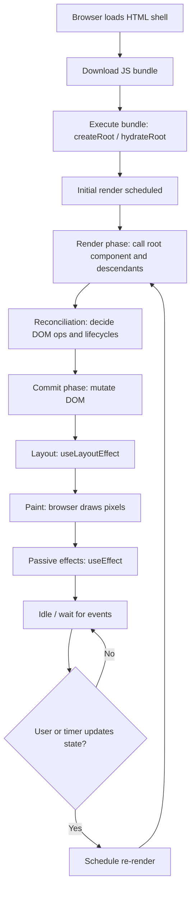
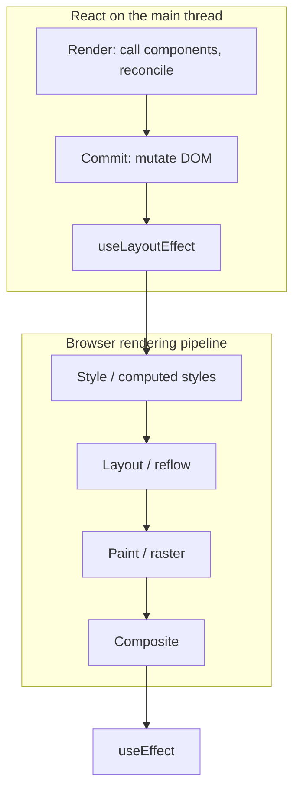

# React rendering flow (overview)

When people say **rendering** in React, they usually mean **the work React does to decide what the UI should be** and **the work the browser does to show it**. Those are related but not the same step.

This page gives you a **mental model**: what happens from opening a React app in the browser through the first screen, how **mounting** fits in, and how React’s work relates to the **JavaScript event loop** (spoiler: React does not replace the event loop; it runs *inside* it).

---

## Terms you will see everywhere

| Term | Meaning |
|------|---------|
| **Render** (React sense) | Calling your component functions and reconciling the tree to produce a **description** of UI (virtual result), not necessarily writing to the DOM yet. |
| **Commit** | Applying changes to the DOM (and running certain effects in order). You can think of this as “make the screen match the latest complete render.” |
| **Mount** | First time a component instance is **created and attached** to the tree; its UI is inserted into the DOM when that subtree is committed. |
| **Unmount** | A component instance is **removed** from the tree; its DOM is removed and cleanup runs. |
| **Re-render** | A later render of a component that **already exists** (often because state or props changed). |
| **Reconciliation** | Diffing the new element tree against the previous one to decide **minimal updates** (and which instances to mount, update, or unmount). |

Mounting and unmounting are **lifecycle outcomes** of reconciliation + commit: they are not a separate “mystery phase,” but they matter when you think about `useEffect` cleanup, subscriptions, and animations.

---

## Is there a “React event loop”?

**No separate loop.** The browser still has **one JavaScript event loop**: tasks (macrotasks), **microtasks** (Promise callbacks, in order), and rendering/painting according to the browser’s schedule.

What React adds is **its own scheduler and commit pipeline** *on top of* that loop:

- When state updates, React **schedules** an update (often **batched** with other updates in the same event handler).
- React walks the component tree, **renders** (pure-ish work: call components, diff), then **commits** DOM changes when ready.
- `useEffect` runs **after** the browser has **painted** the committed UI (unless you use `useLayoutEffect`, which runs **synchronously after DOM mutations** but before paint — see [Effects and layout](#effects-and-layout)).

So the analogy to “callbacks on a queue” is **partially** helpful:

| Event loop idea | Rough React analogue |
|-----------------|----------------------|
| One thread runs JS | Same: React’s render/commit work runs on the main thread unless you offload work yourself (workers, etc.). |
| Tasks queued and drained | Updates are **scheduled**; React may **batch** them and **prioritize** (especially with concurrent features). |
| Microtasks run before the next task | After commit, **passive effects** (`useEffect`) are flushed in order; layout effects (`useLayoutEffect`) fire earlier in the commit phase. |

There is **no** second global loop equal to the browser’s — just **structured phases** that React runs when it gets control from the event loop.

---

## First visit: from HTML to a mounted component

Below is the usual **client-rendered** path (an SPA). Server rendering adds a **hydration** path, but the **commit + effects** story is still recognizable.

**Narrative (plain English):**

1. **HTML/JS load** — You get a minimal page plus scripts.
2. **Entry runs** — e.g. `createRoot(document.getElementById('root')).render(<App />)` (React 18+ API).
3. **Initial render** — React walks from `<App />` down: your function components **run**, returning elements. This builds React’s internal tree (Fibers) and figures out **what DOM should exist**.
4. **Commit** — React applies DOM inserts/updates. For new nodes, this is **mounting** at the DOM level.
5. **Layout effects** — `useLayoutEffect` runs if present: read layout, sync DOM tweaks before the user sees a wrong frame.
6. **Paint** — Browser draws.
7. **Passive effects** — `useEffect` runs **after paint** for work that should not block painting (data fetch, subscriptions, logging).

After that, the app mostly **waits on the normal event loop** until something schedules an update.

---

## A state update: render → commit → effects

When you call `setState` (or the parent re-renders and passes new props), the same **render → commit** pattern repeats. Unmounting happens when reconciliation decides a subtree is **gone** (e.g. conditional `{show && <Child />}` becomes false).

| Order | Phase | What happens (simplified) |
|-------|--------|---------------------------|
| 1 | **Schedule** | Update is queued (often batched with others from the same tick). |
| 2 | **Render** | Components run again; React computes the *next* tree and diffs. |
| 3 | **Commit** | DOM updates; **mount** new instances, **update** existing ones, **unmount** removed ones. |
| 4 | **Layout effects** | `useLayoutEffect` in tree order (mount/update) and cleanup on unmount when needed. |
| 5 | **Paint** | Browser paints. |
| 6 | **Passive effects** | `useEffect` cleanups (if deps changed or unmount), then `useEffect` setups. |

Unmounting is **part of commit** for subtrees that disappeared: DOM nodes are removed, and effect cleanups run (layout first, then passive — per the rules for that phase).

---

## React and the browser pipeline (style, layout, paint, composite)

The browser does not “paint” when your component function runs. After React finishes a **commit**, the browser still has to turn the updated DOM + CSS into pixels. That work is often described as the **rendering pipeline** or **critical path** on the **main thread** (the same thread where your React code runs, unless you use workers).

### What the browser does (one frame, simplified)

Names differ slightly between engines and DevTools labels, but the **idea** is stable:

| Stage | Also called | What it is (intuition) |
|-------|-------------|-------------------------|
| **Style** | Recalculate style | Match DOM nodes to CSS rules and compute **computed values** (colors, fonts, `display`, etc.). |
| **Layout** | Reflow | Turn styles into **geometry**: positions and sizes of boxes (where things are). |
| **Paint** | Rasterization | Fill in pixels for regions that need it (text, backgrounds, borders, images). |
| **Composite** | Compositing | Combine **layers** into the final image the user sees (GPU often helps here). |

If a change only affects “compositor-friendly” properties (e.g. `transform`, `opacity` on a promoted layer), modern browsers may **skip layout and/or full paint** for that update. When you change something that affects **geometry** or **layout**, the browser typically has to do **layout** again for the affected subtree. React does not replace these rules — it just **updates the DOM** during commit, which can **invalidate** later pipeline stages.

### Where React sits on that path

Think of one update cycle like this:

1. **React render** — Pure JS: your components run; **no DOM yet**. No style/layout/paint from the browser for React’s work alone.
2. **React commit** — DOM mutations (insert/update/delete nodes, attributes, text). This marks the browser’s world as **dirty**: the next time the browser renders a frame, it will need to do **some** of style → layout → paint → composite (how much depends on what changed).
3. **`useLayoutEffect`** — Runs **synchronously** after those DOM mutations **and before paint**. This is your hook for measuring layout (`getBoundingClientRect`, etc.) or applying DOM tweaks **before the user sees** the intermediate frame. Heavy work here **blocks** the pipeline from finishing.
4. **Browser pipeline** — **Style → layout → paint → composite** for that frame (possibly accelerated or skipped in part).
5. **`useEffect`** — Runs **after** the browser has **painted** the committed result. Good for subscriptions, fetches, timers — work that should not block painting.

### First page load vs. an in-app React update

| Moment | Network & setup | React | Browser pipeline |
|--------|------------------|-------|------------------|
| **Cold load** | DNS, TLS, HTML, CSS, JS download & parse | (not running yet) | HTML/CSS may be **styled → laid out → painted** for the shell |
| **App boots** | — | `createRoot(…).render` → render → commit | Style/layout/paint/composite for the **new** DOM React inserted |
| **Later `setState`** | — | Re-render → commit | Another frame’s worth of pipeline work **if** the DOM/CSS changed visibly |

So “visiting a React app” is still **loading assets over the network**, then running JS; **React’s first commit** is one reason the **main-thread** pipeline runs to show your UI. After that, **each committed update** can trigger another trip through **style → layout → paint → composite** on a frame (the browser may coalesce work).

### Practical takeaway

| If you… | You mostly affect… |
|---------|---------------------|
| Compute UI in render / return JSX | Only **React’s** render phase (still JS — **not** browser paint). |
| Commit DOM updates | **What the browser must reconcile** on the next frame(s). |
| Do synchronous layout reads/writes | **Layout** cost (and possible **forced synchronous layout** if you interleave badly). |
| Run heavy logic in `useLayoutEffect` | **Time to first paint** for that frame. |
| Run heavy logic in `useEffect` | **Later** — paint can happen first, but you may still jank the **next** frames if the work is huge. |

For a deeper, browser-specific picture, Chrome’s **Rendering** docs and DevTools **Performance** panel label these phases explicitly; React’s own docs focus on **render / commit / layout effects / passive effects**, which line up with the diagram above.

---

## Mental model checklist (quick reference)

| Question | Short answer |
|----------|----------------|
| Is mounting “rendering”? | **Mounting** is the **lifecycle** of attaching a new instance; **rendering** is the work to compute the next UI. They meet at **commit**. |
| Why can my component “render twice” in dev? | **Strict Mode** in development intentionally **double-invokes** some paths to surface unsafe side effects; production does not mirror that doubling. |
| Is `useEffect` part of the “render”? | **No** — effects run **after commit** (passive effects after paint). Putting side effects in render/the wrong phase is a common bug. |
| Same as browser “reflow/repaint”? | **Related**: commit can change the DOM; the browser then runs its pipeline. See [React and the browser pipeline](#react-and-the-browser-pipeline-style-layout-paint-composite). React’s “render” does not mean the browser painted yet. |

---

## Where to go next

- **Data flow**: [React data flow patterns](/course-notes/5-react-data-flow-patterns) — how props and state drive those re-renders.
- **JSX baseline**: [JSX and Rendering](/course-notes/2-jsx-and-rendering) — what renders *produce* before React reconciles them.

For authoritative phase ordering details in your React version, rely on the official **React docs** (“Render and commit,” “Synchronizing with Effects”) — small details have evolved across major releases, but the **render vs commit vs effects** distinction remains the stable backbone.
